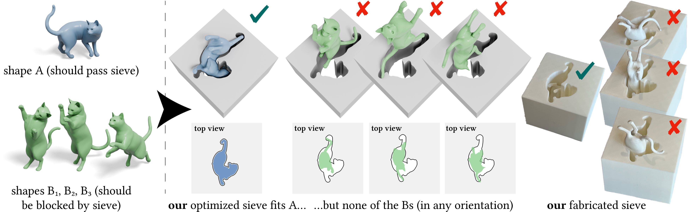

# Computational Design of Shape-Aware Sieves



## About

This repository provides a tool for the inverse design of sieve holes to sort arbitrary input shapes.

It is the source code for the paper ["Computational Design of Shape-Aware Sieves"](https://doi.org/10.1145/3757377.3763875)
published at SIGGRAPH Asia 2025.

For more details, please see the project page: https://david-cha.github.io/projects/sieves/index.html

## Code structure

The structure of the repository is as follows:
```
shape-aware-sieves
├── data
├── figures
├── notebooks
├── results
├── scripts
├── src
│   └── sieves
├── data.tar.gz
└── environment.yml
```

The purpose of each directory or file is as follows:
- `data/` is where all meshes used for experiments must be stored,
   which gets created upon extracting `data.tar.gz`.
- `figures/` contains all scripts for rendering the figures in the paper.
- `notebooks/` contains a Jupyter notebook of a simple demo for interactively exploring the code.
- `results/` stores the output of all experiments in `scripts/`,
   namely the rasters, `results.json`, and `sieve.stl` for each.
- `scripts/` contains the configuration `.json` file and Slurm `.job` file for each experiment.
- `src/` contains the library `sieves`, which implements all algorithms in the paper.
- `data.tar.gz` is the archive of all meshes used in experiments for the paper.
- `environment.yml` is for setting up the Conda environment.

## Installation

The following steps have been used for Linux and were not tested on macOS or Windows.

The system must have CUDA 12.4 or another compatible version installed.

Install and activate the Conda environment via
```
conda env create -f environment.yml

conda activate sieves
```

Depending on the system's CUDA version, the `environment.yml` file may need to be
adjusted to get compatible versions of the Python packages `torch` and `kaolin`.
- For `torch`, see the instructions at https://pytorch.org/get-started/locally/.
- For `kaolin`, see the instructions at https://kaolin.readthedocs.io/en/stable/notes/installation.html.

## Run

Before running any of the scripts, activate the environment and have the archive of
meshes extracted into the `data/` directory by running
```
tar -xvzf data.tar.gz
```

### Running experiments

To launch an experiment in `scripts/`, enter the directory and run
```
python generate_sieve.py {EXPERIMENT}.json ../results/{EXPERIMENT}
```
replacing `{EXPERIMENT}` with the name of the experiment.

Alternatively, after appropriate changes to the directory paths and job settings in
the Slurm `.job` file, run
```
sbatch {EXPERIMENT}.job
```

This will compute a sieve hole for the shapes and parameters specified in the configuration
`.json` file and save the results to `sieves/results/{EXPERIMENT}/`.
Specifically, it will produce the following:
- `sieve.stl` which is a mesh of a rectangular prism with the sieve hole punched through it.
- `results.json` containing the final loss values, optimized orientations, and runtimes of the experiment.
  - Refer to the field `meshes_B_best_losses` for the most accurate final loss values rather than `best_loss`.
- Raster `.png` files showing the optimized orientation of each $B$ mesh against the sieve hole.
  - These correspond to the final losses (`meshes_B_best_losses`) and orientations
    (`meshes_B_rot_vecs` and `meshes_B_trans_vecs`) in `results.json`.

### Running custom experiments

To run custom experiments, add all meshes to be used to the `data/` directory.

Then create a configuration `.json` file inside `scripts/` and run `generate_sieve.py` as described above.

All configuration parameters are explained in docstrings in the source files in `src/sieves/`.
In particular, see the docstring of the function `optimize_posn_of_multi_A()` in `src/sieves/batched_opt.py`.

### Running demo notebook

Activate the environment and from within the `notebooks/` directory, run `jupyter lab`.

### Generating figures

Figures were generated via Blender from the outputs of experiments saved in `results/`.

Blender can be installed by running
```
sudo apt install blender
```

To generate figures, run
```
python render_result_{EXPERIMENT}.py
```
replacing `{EXPERIMENT}` with the name of the experiment.

Alternatively, after appropriate changes to the directory paths and job settings in
the Slurm `.job` file, run
```
sbatch render_result_{EXPERIMENT}.job
```

This will create and save all renders to the directory `figures/{EXPERIMENT}/`.

To see which figures in the paper correspond to which results, see the table at
[`figures/results_to_figures_table.md`](figures/results_to_figures_table.md).

## Citation

```
@inproceedings{cha2025sieves,
  author = {Cha, David and Stein, Oded},
  title = {Computational Design of Shape-Aware Sieves},
  year = {2025},
  isbn = {9798400721373},
  publisher = {Association for Computing Machinery},
  address = {New York, NY, USA},
  url = {https://doi.org/10.1145/3757377.3763875},
  doi = {10.1145/3757377.3763875},
  booktitle = {Proceedings of the SIGGRAPH Asia 2025 Conference Papers},
  articleno = {41},
  numpages = {11},
  series = {SA Conference Papers '25}
}
```
